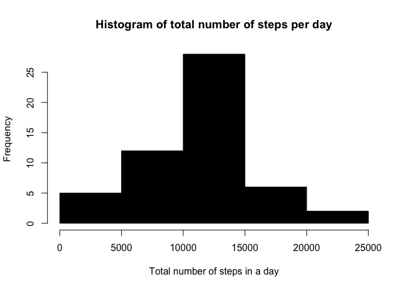
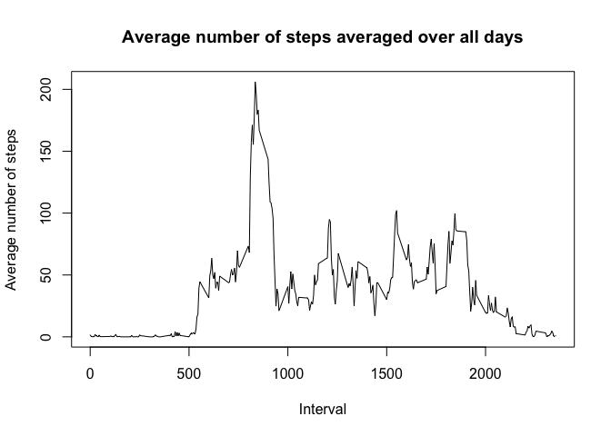
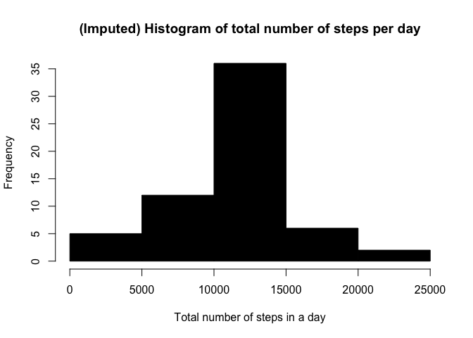
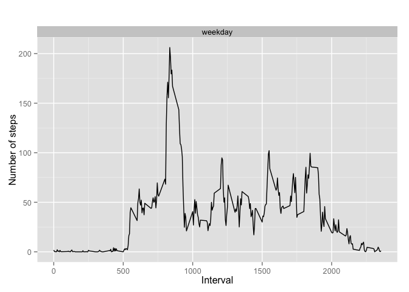

# Reproducible Research: Peer Assessment 1


##Introduction

It is now possible to collect a large amount of data about personal movement using activity monitoring devices such as a Fitbit, Nike Fuelband, or Jawbone Up. These type of devices are part of the “quantified self” movement – a group of enthusiasts who take measurements about themselves regularly to improve their health, to find patterns in their behavior, or because they are tech geeks. But these data remain under-utilized both because the raw data are hard to obtain and there is a lack of statistical methods and software for processing and interpreting the data.

This assignment makes use of data from a personal activity monitoring device. This device collects data at 5 minute intervals through out the day. The data consists of two months of data from an anonymous individual collected during the months of October and November, 2012 and include the number of steps taken in 5 minute intervals each day.

##Data

The data for this assignment can be downloaded from the course web site:

- Dataset: Activity monitoring data [52K]

The variables included in this dataset are:

- **steps**: Number of steps taking in a 5-minute interval (missing values are coded as NA)

- **date**: The date on which the measurement was taken in YYYY-MM-DD format

- **interval**: Identifier for the 5-minute interval in which measurement was taken

The dataset is stored in a comma-separated-value (CSV) file and there are a total of 17,568 observations in this dataset.

## Loading and preprocessing the data

Show any code that is needed to

1. Load the data (i.e. read.csv())

2. Process/transform the data (if necessary) into a format suitable for your analysis

*First we set the file url, create the temporary directory, and the file where the file will be downloaded.*

```r
fileurl <- "https://d396qusza40orc.cloudfront.net/repdata%2Fdata%2Factivity.zip"

td = tempdir()

tf = tempfile(tmpdir=td, fileext=".zip")
```

*Then the files is download into the file. Curl method id used for Mac systems.*

```r
download.file(fileurl, tf, method="curl")
```

*Then get the name of the first file in the archive. Unzip the file in the directory. Load the csv file in a data frame* **df**. 

```r
fname = unzip(tf, list=TRUE)$Name[1]

unzip(tf, files=fname, exdir=td, overwrite=TRUE)

fpath = file.path(td, fname)

df <- read.csv(fpath, as.is=TRUE)
```

## What is mean total number of steps taken per day?

For this part of the assignment, you can ignore the missing values in the dataset.

1. Make a histogram of the total number of steps taken each day.

2. If you do not understand the difference between a histogram and a barplot, research the difference between them. Make a histogram of the total number of steps taken each day.

3. Calculate and report the mean and median total number of steps taken per day.

*First ignore the missing values and generate the data frame* **df2**. Then aggregate the steps per date in order to get the total steps in a day. 

```r
df2 <- na.omit(df)

table_date_steps <- aggregate(steps ~ date, df2, sum)
```

*Plot an histogram of the total number of steps in a day.*

```r
hist(table_date_steps$steps, col=1, main="Histogram of total number of steps per day", 
     xlab="Total number of steps in a day")
```

 

*Get the mean and the median of the number of steps in a day.*

```r
m <-mean(table_date_steps$steps)
m
```

```
## [1] 10766.19
```

```r
med <- median(table_date_steps$steps)
med
```

```
## [1] 10765
```

*The mean is* **1.0766189\times 10^{4}** *and the median* **10765**. 

## What is the average daily activity pattern?

1. Make a time series plot (i.e. type = "l") of the 5-minute interval (x-axis) and the average number of steps taken, averaged across all days (y-axis)

*Aggregate the steps vs interval to get the average number of steps in a days interval. Then plot (line) of the 5-minuts interval and the average number of steps across all days.* 

```r
interval_steps <- aggregate(steps ~ interval, df2, mean)

plot(interval_steps$interval, interval_steps$steps, type='l', col=1, 
     main="Average number of steps averaged over all days", xlab="Interval", 
     ylab="Average number of steps")
```

 

2. Which 5-minute interval, on average across all the days in the dataset, contains the maximum number of steps?

*Find the interval with the maximum averaged number of steps. And then get the average of the steps.*

```r
max_steps_interval <- which.max(interval_steps$steps)

max <- interval_steps [max_steps_interval, ]
max
```

```
##     interval    steps
## 104      835 206.1698
```

*The maximum number of steps is * **206.1698113** *and is in the * **835** *interval.* 

## Imputing missing values

Note that there are a number of days/intervals where there are missing values (coded as NA). The presence of missing days may introduce bias into some calculations or summaries of the data.

1. Calculate and report the total number of missing values in the dataset (i.e. the total number of rows with NAs)

*Get the rows with missing values, and count it.*

```r
df_NA <- df[!complete.cases(df),]

num_NA_rows <- nrow(df_NA)
num_NA_rows
```

```
## [1] 2304
```

*There are * **2304** * with missing values.*

2. Devise a strategy for filling in all of the missing values in the dataset. The strategy does not need to be sophisticated. For example, you could use the mean/median for that day, or the mean for that 5-minute interval, etc.

3. Create a new dataset that is equal to the original dataset but with the missing data filled in.

*Fill the NAs with the average steps for this interval.*

```r
for (i in 1:nrow(df)){
  if (is.na(df$steps[i])){
    interval_val <- df$interval[i]
    row_id <- which(interval_steps$interval == interval_val)
    steps_val <- interval_steps$steps[row_id]
    df$steps[i] <- steps_val
  }
}

table_date_steps_imputed <- aggregate(steps ~ date, df, sum)
```

4. Make a histogram of the total number of steps taken each day and Calculate and report the mean and median total number of steps taken per day. Do these values differ from the estimates from the first part of the assignment? What is the impact of imputing missing data on the estimates of the total daily number of steps?

*Plot an histogram of the total number of steps in a day. Get the mean and median of the steps per day. And compare with the mean and median without the missing values filled.*

```r
# create histogram of total number of steps in a day
hist(table_date_steps_imputed$steps, col=1, main="(Imputed) Histogram of total number of steps per day", xlab="Total number of steps in a day")
```

 

```r
# get mean and median of total number of steps per day
m_imputted <- mean(table_date_steps_imputed$steps)
m_imputted
```

```
## [1] 10766.19
```

```r
med_imputted <- median(table_date_steps_imputed$steps)
med_imputted
```

```
## [1] 10766.19
```
*The mean is* **1.0766189\times 10^{4}** *and the median* **1.0766189\times 10^{4}** *for the steps data with the missing values filled with the average.* 
*The mean is* **1.0766189\times 10^{4}** *and the median* **10765** *for the steps data without the missing values.*

## Are there differences in activity patterns between weekdays and weekends?

For this part the weekdays() function may be of some help here. Use the dataset with the filled-in missing values for this part.

1. Create a new factor variable in the dataset with two levels – “weekday” and “weekend” indicating whether a given date is a weekday or weekend day.

* First convert date string from data into date type. Add a new column indicating the day of the week. Then add another column with 'weekday' or 'weekend'. And convert the strings into a factor.*

```r
df$date <- as.Date(df$date, "%Y-%m-%d")

df$day <- weekdays(df$date)

df$day_type <- c("weekday")

for (i in 1:nrow(df)){
  if (df$day[i] == "Saturday" || df$day[i] == "Sunday"){
    df$day_type[i] <- "weekend"
  }
}

df$day_type <- as.factor(df$day_type)
```

2. Make a panel plot containing a time series plot (i.e. type = "l") of the 5-minute interval (x-axis) and the average number of steps taken, averaged across all weekday days or weekend days (y-axis). See the README file in the GitHub repository to see an example of what this plot should look like using simulated data.

*Aggregate the steps as interval to get average number of steps in an interval across the days. Then plot the panel.*


```r
interval_steps_imputed <- aggregate(steps ~ interval+day_type, df, mean)

library(ggplot2)
```

```
## Warning: package 'ggplot2' was built under R version 3.1.3
```

```r
qplot(interval, steps, data=interval_steps_imputed, geom=c("line"), xlab="Interval", 
      ylab="Number of steps", main="") + facet_wrap(~ day_type, ncol=1)
```

 
